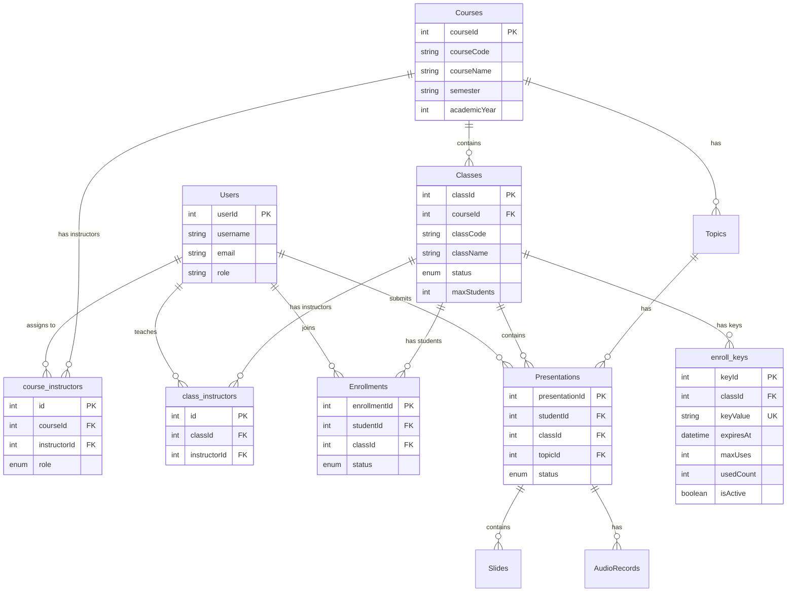

# Class & Enrollment Key Implementation Plan

**OratorAI/Duckne - Course Management Enhancement**  
**Date**: January 31, 2026  
**Version**: 1.0

---

## 📋 Executive Summary

### Current State

- ✅ Basic Course/Enrollment system exists (Course → Student direct)
- ✅ RBAC framework (Admin/Instructor/Student roles)
- ✅ Sequelize migrations + models + services pattern
- ✅ Pipeline: Upload → ASR → Analysis → Report

### New Requirements

1. **Hierarchical Structure**: Course → Classes (many) → Enrollments (many students per class)
2. **Multi-Instructor Support**:
   - Course can have many instructors (course_instructors)
   - Class can have many instructors (class_instructors)
   - Instructor can teach multiple classes within same course
3. **Enrollment Keys**: Secure class join mechanism with expiration, usage limits, rotation
4. **Access Control**: Students see only joined classes, Instructors see only assigned classes
5. **Presentation Filtering**: Link presentations to classes for instructor filtering

---

## 🗄️ Database Schema Design

### Tables Overview

| Table                | Purpose                                           | Relationships              |
| -------------------- | ------------------------------------------------- | -------------------------- |
| `courses`            | **EXISTING** - Update to support multi-instructor | Remove `instructorId` FK   |
| `course_instructors` | **NEW** - Map instructors to courses              | M:N (Course ↔ Instructor)  |
| `classes`            | **NEW** - Class/section within course             | N:1 (Class → Course)       |
| `class_instructors`  | **NEW** - Map instructors to classes              | M:N (Class ↔ Instructor)   |
| `enroll_keys`        | **NEW** - Enrollment keys for classes             | N:1 (Key → Class)          |
| `enrollments`        | **UPDATE** - Change from Course to Class          | N:1 (Enrollment → Class)   |
| `presentations`      | **UPDATE** - Add classId FK                       | N:1 (Presentation → Class) |

---

### Detailed Schema

#### 1. `course_instructors` (NEW)

```sql
CREATE TABLE course_instructors (
  id INT AUTO_INCREMENT PRIMARY KEY,
  courseId INT NOT NULL,
  instructorId INT NOT NULL,
  role ENUM('lead', 'assistant', 'guest') DEFAULT 'lead',
  assignedAt DATETIME DEFAULT CURRENT_TIMESTAMP,
  assignedBy INT NULL COMMENT 'Admin userId who assigned',

  FOREIGN KEY (courseId) REFERENCES Courses(courseId) ON DELETE CASCADE,
  FOREIGN KEY (instructorId) REFERENCES Users(userId) ON DELETE CASCADE,
  FOREIGN KEY (assignedBy) REFERENCES Users(userId) ON DELETE SET NULL,

  UNIQUE KEY uq_course_instructor (courseId, instructorId),
  INDEX idx_course (courseId),
  INDEX idx_instructor (instructorId)
);
```

**Constraints**:

- Unique `(courseId, instructorId)` - 1 instructor cannot be added twice to same course
- CASCADE on course/instructor delete
- `assignedBy` tracks which admin assigned (optional audit trail)

---

#### 2. `classes` (NEW)

```sql
CREATE TABLE classes (
  classId INT AUTO_INCREMENT PRIMARY KEY,
  courseId INT NOT NULL,
  classCode VARCHAR(50) NOT NULL COMMENT 'e.g., CS101-L01, CS101-L02',
  className VARCHAR(200) NOT NULL COMMENT 'e.g., Section A, Monday 8AM',
  description TEXT NULL,

  status ENUM('active', 'closed', 'archived') DEFAULT 'active',
  startDate DATE NULL,
  endDate DATE NULL,
  maxStudents INT NULL COMMENT 'Optional enrollment cap',

  createdBy INT NOT NULL COMMENT 'Admin or lead instructor',
  createdAt DATETIME DEFAULT CURRENT_TIMESTAMP,
  updatedAt DATETIME DEFAULT CURRENT_TIMESTAMP ON UPDATE CURRENT_TIMESTAMP,

  FOREIGN KEY (courseId) REFERENCES Courses(courseId) ON DELETE RESTRICT,
  FOREIGN KEY (createdBy) REFERENCES Users(userId) ON DELETE RESTRICT,

  UNIQUE KEY uq_class_code_per_course (courseId, classCode),
  INDEX idx_course (courseId),
  INDEX idx_status (status)
);
```

**Business Rules**:

- `classCode` unique per course (e.g., CS101-L01, CS101-L02)
- RESTRICT delete if course deleted (protect data)
- `status`:
  - `active`: Accepting enrollments, active presentations
  - `closed`: No new enrollments, existing students can submit
  - `archived`: Read-only, no new submissions

---

#### 3. `class_instructors` (NEW)

```sql
CREATE TABLE class_instructors (
  id INT AUTO_INCREMENT PRIMARY KEY,
  classId INT NOT NULL,
  instructorId INT NOT NULL,
  assignedAt DATETIME DEFAULT CURRENT_TIMESTAMP,
  assignedBy INT NULL COMMENT 'Admin or lead instructor',

  FOREIGN KEY (classId) REFERENCES Classes(classId) ON DELETE CASCADE,
  FOREIGN KEY (instructorId) REFERENCES Users(userId) ON DELETE CASCADE,
  FOREIGN KEY (assignedBy) REFERENCES Users(userId) ON DELETE SET NULL,

  UNIQUE KEY uq_class_instructor (classId, instructorId),
  INDEX idx_class (classId),
  INDEX idx_instructor (instructorId)
);
```

**Authorization Rule**:

- Instructor can manage class (create keys, view students) ONLY IF:
  1. In `course_instructors` for class's course, AND
  2. In `class_instructors` for the class
- This supports: 1 instructor teaches multiple classes, 1 class has multiple instructors

---

#### 4. `enroll_keys` (NEW)

```sql
CREATE TABLE enroll_keys (
  keyId INT AUTO_INCREMENT PRIMARY KEY,
  classId INT NOT NULL,
  keyValue VARCHAR(255) NOT NULL COMMENT 'e.g., UUID or random string',

  expiresAt DATETIME NULL COMMENT 'NULL = no expiration',
  maxUses INT NULL COMMENT 'NULL = unlimited',
  usedCount INT DEFAULT 0 COMMENT 'Atomic increment on join',

  isActive BOOLEAN DEFAULT TRUE,
  isRevoked BOOLEAN DEFAULT FALSE,
  revokedAt DATETIME NULL,
  revokedBy INT NULL COMMENT 'userId who revoked',

  createdBy INT NOT NULL COMMENT 'Admin or instructor',
  createdAt DATETIME DEFAULT CURRENT_TIMESTAMP,
  updatedAt DATETIME DEFAULT CURRENT_TIMESTAMP ON UPDATE CURRENT_TIMESTAMP,

  FOREIGN KEY (classId) REFERENCES Classes(classId) ON DELETE CASCADE,
  FOREIGN KEY (createdBy) REFERENCES Users(userId) ON DELETE RESTRICT,
  FOREIGN KEY (revokedBy) REFERENCES Users(userId) ON DELETE SET NULL,

  UNIQUE KEY uq_key_value (keyValue),
  INDEX idx_class (classId),
  INDEX idx_active (isActive, expiresAt)
);
```

**Validation Logic** (before join):

```javascript
const key = await EnrollKey.findOne({ where: { keyValue } });

// Check 1: Key exists
if (!key) throw new Error('Invalid enrollment key');

// Check 2: Active
if (!key.isActive || key.isRevoked) throw new Error('Key is inactive or revoked');

// Check 3: Not expired
if (key.expiresAt && new Date() > new Date(key.expiresAt)) {
  throw new Error('Enrollment key has expired');
}

// Check 4: Usage limit
if (key.maxUses && key.usedCount >= key.maxUses) {
  throw new Error('Enrollment key usage limit reached');
}

// Atomic increment (transaction)
await sequelize.transaction(async (t) => {
  // Check again inside transaction (race condition protection)
  const freshKey = await EnrollKey.findByPk(key.keyId, {
    lock: t.LOCK.UPDATE,
    transaction: t
  });

  if (freshKey.maxUses && freshKey.usedCount >= freshKey.maxUses) {
    throw new Error('Enrollment key usage limit reached');
  }

  await freshKey.increment('usedCount', { transaction: t });
  await Enrollment.create({ ... }, { transaction: t });
});
```

---

#### 5. Update `enrollments` Table

```sql
-- MIGRATION: Change enrollment from Course → Class

-- Step 1: Add classId column (nullable initially)
ALTER TABLE Enrollments
ADD COLUMN classId INT NULL AFTER enrollmentId,
ADD FOREIGN KEY (classId) REFERENCES Classes(classId) ON DELETE CASCADE;

-- Step 2: Data migration (if needed - or start fresh)
-- Option A: Drop old enrollments and start fresh
TRUNCATE TABLE Enrollments;

-- Option B: Migrate existing enrollments to a default class per course
-- (Requires creating a "General" class for each course first)

-- Step 3: Make classId NOT NULL
ALTER TABLE Enrollments MODIFY classId INT NOT NULL;

-- Step 4: Drop courseId FK and column
ALTER TABLE Enrollments DROP FOREIGN KEY fk_enrollments_course;
ALTER TABLE Enrollments DROP COLUMN courseId;

-- Step 5: Update unique constraint
ALTER TABLE Enrollments DROP INDEX uq_enrollments_student_course;
ALTER TABLE Enrollments ADD UNIQUE KEY uq_enrollments_student_class (studentId, classId);

-- Final schema:
CREATE TABLE Enrollments (
  enrollmentId INT AUTO_INCREMENT PRIMARY KEY,
  studentId INT NOT NULL,
  classId INT NOT NULL,

  joinedAt DATETIME DEFAULT CURRENT_TIMESTAMP,
  status ENUM('enrolled', 'dropped', 'completed') DEFAULT 'enrolled',
  finalGrade FLOAT NULL,

  createdAt DATETIME DEFAULT CURRENT_TIMESTAMP,
  updatedAt DATETIME DEFAULT CURRENT_TIMESTAMP ON UPDATE CURRENT_TIMESTAMP,

  FOREIGN KEY (studentId) REFERENCES Users(userId) ON DELETE CASCADE,
  FOREIGN KEY (classId) REFERENCES Classes(classId) ON DELETE CASCADE,

  UNIQUE KEY uq_enrollments_student_class (studentId, classId),
  INDEX idx_class (classId),
  INDEX idx_student (studentId),
  INDEX idx_status (status)
);
```

---

#### 6. Update `presentations` Table

```sql
-- Add classId FK to presentations

ALTER TABLE Presentations
ADD COLUMN classId INT NULL AFTER presentationId,
ADD FOREIGN KEY (classId) REFERENCES Classes(classId) ON DELETE RESTRICT;

-- Data migration: Link existing presentations to default class
-- (Requires courseId → classId mapping via a default class per course)

-- Make classId NOT NULL after migration
ALTER TABLE Presentations MODIFY classId INT NOT NULL;

-- Add index for instructor filtering
ALTER TABLE Presentations ADD INDEX idx_class (classId);

-- Final: Presentations now linked to Class (which belongs to Course)
-- Instructor query:
-- SELECT * FROM Presentations p
-- JOIN Classes c ON p.classId = c.classId
-- JOIN class_instructors ci ON c.classId = ci.classId
-- WHERE ci.instructorId = ?
```

---

#### 7. Update `courses` Table

```sql
-- Remove single instructor FK (now in course_instructors M:N)

ALTER TABLE Courses DROP FOREIGN KEY fk_courses_instructor;
ALTER TABLE Courses DROP INDEX idx_courses_instructor;
ALTER TABLE Courses DROP COLUMN instructorId;

-- Courses now only have metadata, instructors via course_instructors
```

---

## 📊 Entity Relationship Diagram



---

## 🛠️ Implementation Steps (Timeline)

### **Phase 1: Database Layer (Day 1 - 8 hours)**

#### Step 1.1: Create Migrations (3 hours)

**Files to create:**

1. `src/migrations/20260131000001-remove-course-instructorId.js`

```javascript
// Remove single instructor FK from Courses
// Note: Run AFTER course_instructors populated
module.exports = {
  up: async (queryInterface, Sequelize) => {
    await queryInterface.removeConstraint("Courses", "Courses_ibfk_1");
    await queryInterface.removeIndex("Courses", "idx_courses_instructor");
    await queryInterface.removeColumn("Courses", "instructorId");
  },
  down: async (queryInterface, Sequelize) => {
    await queryInterface.addColumn("Courses", "instructorId", {
      type: Sequelize.INTEGER,
      allowNull: true,
      references: { model: "Users", key: "userId" },
    });
    await queryInterface.addIndex("Courses", ["instructorId"], {
      name: "idx_courses_instructor",
    });
  },
};
```

2. `src/migrations/20260131000002-create-course-instructors.js`

```javascript
module.exports = {
  up: async (queryInterface, Sequelize) => {
    await queryInterface.createTable("course_instructors", {
      id: {
        type: Sequelize.INTEGER,
        autoIncrement: true,
        primaryKey: true,
      },
      courseId: {
        type: Sequelize.INTEGER,
        allowNull: false,
        references: { model: "Courses", key: "courseId" },
        onDelete: "CASCADE",
        onUpdate: "CASCADE",
      },
      instructorId: {
        type: Sequelize.INTEGER,
        allowNull: false,
        references: { model: "Users", key: "userId" },
        onDelete: "CASCADE",
        onUpdate: "CASCADE",
      },
      role: {
        type: Sequelize.ENUM("lead", "assistant", "guest"),
        allowNull: false,
        defaultValue: "lead",
      },
      assignedAt: {
        type: Sequelize.DATE,
        allowNull: false,
        defaultValue: Sequelize.literal("CURRENT_TIMESTAMP"),
      },
      assignedBy: {
        type: Sequelize.INTEGER,
        allowNull: true,
        references: { model: "Users", key: "userId" },
        onDelete: "SET NULL",
      },
    });

    await queryInterface.addConstraint("course_instructors", {
      fields: ["courseId", "instructorId"],
      type: "unique",
      name: "uq_course_instructor",
    });

    await queryInterface.addIndex("course_instructors", ["courseId"], {
      name: "idx_course_instructors_course",
    });

    await queryInterface.addIndex("course_instructors", ["instructorId"], {
      name: "idx_course_instructors_instructor",
    });
  },
  down: async (queryInterface) => {
    await queryInterface.dropTable("course_instructors");
  },
};
```

3. `src/migrations/20260131000003-create-classes.js`

```javascript
module.exports = {
  up: async (queryInterface, Sequelize) => {
    await queryInterface.createTable("Classes", {
      classId: {
        type: Sequelize.INTEGER,
        autoIncrement: true,
        primaryKey: true,
      },
      courseId: {
        type: Sequelize.INTEGER,
        allowNull: false,
        references: { model: "Courses", key: "courseId" },
        onDelete: "RESTRICT",
        onUpdate: "CASCADE",
      },
      classCode: {
        type: Sequelize.STRING(50),
        allowNull: false,
      },
      className: {
        type: Sequelize.STRING(200),
        allowNull: false,
      },
      description: {
        type: Sequelize.TEXT,
      },
      status: {
        type: Sequelize.ENUM("active", "closed", "archived"),
        allowNull: false,
        defaultValue: "active",
      },
      startDate: {
        type: Sequelize.DATEONLY,
      },
      endDate: {
        type: Sequelize.DATEONLY,
      },
      maxStudents: {
        type: Sequelize.INTEGER,
      },
      createdBy: {
        type: Sequelize.INTEGER,
        allowNull: false,
        references: { model: "Users", key: "userId" },
        onDelete: "RESTRICT",
      },
      createdAt: {
        type: Sequelize.DATE,
        allowNull: false,
        defaultValue: Sequelize.literal("CURRENT_TIMESTAMP"),
      },
      updatedAt: {
        type: Sequelize.DATE,
        allowNull: false,
        defaultValue: Sequelize.literal("CURRENT_TIMESTAMP"),
      },
    });

    await queryInterface.addConstraint("Classes", {
      fields: ["courseId", "classCode"],
      type: "unique",
      name: "uq_class_code_per_course",
    });

    await queryInterface.addIndex("Classes", ["courseId"], {
      name: "idx_classes_course",
    });

    await queryInterface.addIndex("Classes", ["status"], {
      name: "idx_classes_status",
    });
  },
  down: async (queryInterface) => {
    await queryInterface.dropTable("Classes");
  },
};
```

4. `src/migrations/20260131000004-create-class-instructors.js`

```javascript
module.exports = {
  up: async (queryInterface, Sequelize) => {
    await queryInterface.createTable("class_instructors", {
      id: {
        type: Sequelize.INTEGER,
        autoIncrement: true,
        primaryKey: true,
      },
      classId: {
        type: Sequelize.INTEGER,
        allowNull: false,
        references: { model: "Classes", key: "classId" },
        onDelete: "CASCADE",
        onUpdate: "CASCADE",
      },
      instructorId: {
        type: Sequelize.INTEGER,
        allowNull: false,
        references: { model: "Users", key: "userId" },
        onDelete: "CASCADE",
        onUpdate: "CASCADE",
      },
      assignedAt: {
        type: Sequelize.DATE,
        allowNull: false,
        defaultValue: Sequelize.literal("CURRENT_TIMESTAMP"),
      },
      assignedBy: {
        type: Sequelize.INTEGER,
        allowNull: true,
        references: { model: "Users", key: "userId" },
        onDelete: "SET NULL",
      },
    });

    await queryInterface.addConstraint("class_instructors", {
      fields: ["classId", "instructorId"],
      type: "unique",
      name: "uq_class_instructor",
    });

    await queryInterface.addIndex("class_instructors", ["classId"], {
      name: "idx_class_instructors_class",
    });

    await queryInterface.addIndex("class_instructors", ["instructorId"], {
      name: "idx_class_instructors_instructor",
    });
  },
  down: async (queryInterface) => {
    await queryInterface.dropTable("class_instructors");
  },
};
```

5. `src/migrations/20260131000005-create-enroll-keys.js`

```javascript
module.exports = {
  up: async (queryInterface, Sequelize) => {
    await queryInterface.createTable("enroll_keys", {
      keyId: {
        type: Sequelize.INTEGER,
        autoIncrement: true,
        primaryKey: true,
      },
      classId: {
        type: Sequelize.INTEGER,
        allowNull: false,
        references: { model: "Classes", key: "classId" },
        onDelete: "CASCADE",
        onUpdate: "CASCADE",
      },
      keyValue: {
        type: Sequelize.STRING(255),
        allowNull: false,
        unique: true,
      },
      expiresAt: {
        type: Sequelize.DATE,
        allowNull: true,
      },
      maxUses: {
        type: Sequelize.INTEGER,
        allowNull: true,
      },
      usedCount: {
        type: Sequelize.INTEGER,
        allowNull: false,
        defaultValue: 0,
      },
      isActive: {
        type: Sequelize.BOOLEAN,
        allowNull: false,
        defaultValue: true,
      },
      isRevoked: {
        type: Sequelize.BOOLEAN,
        allowNull: false,
        defaultValue: false,
      },
      revokedAt: {
        type: Sequelize.DATE,
      },
      revokedBy: {
        type: Sequelize.INTEGER,
        references: { model: "Users", key: "userId" },
        onDelete: "SET NULL",
      },
      createdBy: {
        type: Sequelize.INTEGER,
        allowNull: false,
        references: { model: "Users", key: "userId" },
        onDelete: "RESTRICT",
      },
      createdAt: {
        type: Sequelize.DATE,
        allowNull: false,
        defaultValue: Sequelize.literal("CURRENT_TIMESTAMP"),
      },
      updatedAt: {
        type: Sequelize.DATE,
        allowNull: false,
        defaultValue: Sequelize.literal("CURRENT_TIMESTAMP"),
      },
    });

    await queryInterface.addIndex("enroll_keys", ["keyValue"], {
      name: "uq_enroll_key_value",
      unique: true,
    });

    await queryInterface.addIndex("enroll_keys", ["classId"], {
      name: "idx_enroll_keys_class",
    });

    await queryInterface.addIndex("enroll_keys", ["isActive", "expiresAt"], {
      name: "idx_enroll_keys_active_expiry",
    });
  },
  down: async (queryInterface) => {
    await queryInterface.dropTable("enroll_keys");
  },
};
```

6. `src/migrations/20260131000006-update-enrollments-add-classId.js`

```javascript
module.exports = {
  up: async (queryInterface, Sequelize) => {
    // Step 1: Add classId column (nullable)
    await queryInterface.addColumn("Enrollments", "classId", {
      type: Sequelize.INTEGER,
      allowNull: true, // Will be NOT NULL after data migration
      references: { model: "Classes", key: "classId" },
      onDelete: "CASCADE",
      after: "enrollmentId",
    });

    // Step 2: Data migration (if needed)
    // Option: Truncate old enrollments
    await queryInterface.sequelize.query("TRUNCATE TABLE Enrollments");

    // Step 3: Make classId NOT NULL
    await queryInterface.changeColumn("Enrollments", "classId", {
      type: Sequelize.INTEGER,
      allowNull: false,
    });

    // Step 4: Remove courseId FK and column
    await queryInterface.removeConstraint("Enrollments", "Enrollments_ibfk_2");
    await queryInterface.removeIndex("Enrollments", "idx_enrollments_course");
    await queryInterface.removeColumn("Enrollments", "courseId");

    // Step 5: Update unique constraint
    await queryInterface.removeConstraint(
      "Enrollments",
      "uq_enrollments_student_course",
    );
    await queryInterface.addConstraint("Enrollments", {
      fields: ["studentId", "classId"],
      type: "unique",
      name: "uq_enrollments_student_class",
    });

    await queryInterface.addIndex("Enrollments", ["classId"], {
      name: "idx_enrollments_class",
    });
  },

  down: async (queryInterface, Sequelize) => {
    // Reverse migration
    await queryInterface.addColumn("Enrollments", "courseId", {
      type: Sequelize.INTEGER,
      allowNull: false,
      references: { model: "Courses", key: "courseId" },
    });

    await queryInterface.removeConstraint(
      "Enrollments",
      "uq_enrollments_student_class",
    );
    await queryInterface.addConstraint("Enrollments", {
      fields: ["studentId", "courseId"],
      type: "unique",
      name: "uq_enrollments_student_course",
    });

    await queryInterface.removeColumn("Enrollments", "classId");
  },
};
```

7. `src/migrations/20260131000007-update-presentations-add-classId.js`

```javascript
module.exports = {
  up: async (queryInterface, Sequelize) => {
    // Add classId to Presentations
    await queryInterface.addColumn("Presentations", "classId", {
      type: Sequelize.INTEGER,
      allowNull: true, // Will be NOT NULL after migration
      references: { model: "Classes", key: "classId" },
      onDelete: "RESTRICT",
      after: "presentationId",
    });

    // Data migration: Set classId based on courseId
    // (Requires manual mapping or creating default class per course)
    // For now, allow NULL until data migration script runs

    // Make classId NOT NULL after data migration
    // await queryInterface.changeColumn('Presentations', 'classId', {
    //   type: Sequelize.INTEGER,
    //   allowNull: false
    // });

    await queryInterface.addIndex("Presentations", ["classId"], {
      name: "idx_presentations_class",
    });
  },

  down: async (queryInterface) => {
    await queryInterface.removeIndex(
      "Presentations",
      "idx_presentations_class",
    );
    await queryInterface.removeColumn("Presentations", "classId");
  },
};
```

**Estimated Time**: 3 hours (includes testing migrations)

---

#### Step 1.2: Create Sequelize Models (2 hours)

**Files to create:**

1. `src/models/CourseInstructor.js`

```javascript
export default (sequelize, DataTypes) => {
  const CourseInstructor = sequelize.define(
    "CourseInstructor",
    {
      id: {
        type: DataTypes.INTEGER,
        autoIncrement: true,
        primaryKey: true,
      },
      courseId: {
        type: DataTypes.INTEGER,
        allowNull: false,
      },
      instructorId: {
        type: DataTypes.INTEGER,
        allowNull: false,
      },
      role: {
        type: DataTypes.ENUM("lead", "assistant", "guest"),
        allowNull: false,
        defaultValue: "lead",
      },
      assignedAt: {
        type: DataTypes.DATE,
        allowNull: false,
        defaultValue: DataTypes.NOW,
      },
      assignedBy: {
        type: DataTypes.INTEGER,
        allowNull: true,
      },
    },
    {
      tableName: "course_instructors",
      timestamps: false,
      indexes: [
        { unique: true, fields: ["courseId", "instructorId"] },
        { fields: ["courseId"] },
        { fields: ["instructorId"] },
      ],
    },
  );

  CourseInstructor.associate = (models) => {
    CourseInstructor.belongsTo(models.Course, {
      foreignKey: "courseId",
      as: "course",
    });
    CourseInstructor.belongsTo(models.User, {
      foreignKey: "instructorId",
      as: "instructor",
    });
    CourseInstructor.belongsTo(models.User, {
      foreignKey: "assignedBy",
      as: "assigner",
    });
  };

  return CourseInstructor;
};
```

2. `src/models/Class.js`

```javascript
export default (sequelize, DataTypes) => {
  const Class = sequelize.define(
    "Class",
    {
      classId: {
        type: DataTypes.INTEGER,
        autoIncrement: true,
        primaryKey: true,
      },
      courseId: {
        type: DataTypes.INTEGER,
        allowNull: false,
      },
      classCode: {
        type: DataTypes.STRING(50),
        allowNull: false,
      },
      className: {
        type: DataTypes.STRING(200),
        allowNull: false,
      },
      description: {
        type: DataTypes.TEXT,
      },
      status: {
        type: DataTypes.ENUM("active", "closed", "archived"),
        allowNull: false,
        defaultValue: "active",
      },
      startDate: {
        type: DataTypes.DATEONLY,
      },
      endDate: {
        type: DataTypes.DATEONLY,
      },
      maxStudents: {
        type: DataTypes.INTEGER,
      },
      createdBy: {
        type: DataTypes.INTEGER,
        allowNull: false,
      },
    },
    {
      tableName: "Classes",
      timestamps: true,
      indexes: [
        { unique: true, fields: ["courseId", "classCode"] },
        { fields: ["courseId"] },
        { fields: ["status"] },
      ],
    },
  );

  Class.associate = (models) => {
    Class.belongsTo(models.Course, {
      foreignKey: "courseId",
      as: "course",
    });
    Class.belongsTo(models.User, {
      foreignKey: "createdBy",
      as: "creator",
    });
    Class.belongsToMany(models.User, {
      through: models.ClassInstructor,
      foreignKey: "classId",
      otherKey: "instructorId",
      as: "instructors",
    });
    Class.hasMany(models.ClassInstructor, {
      foreignKey: "classId",
      as: "classInstructors",
    });
    Class.hasMany(models.EnrollKey, {
      foreignKey: "classId",
      as: "enrollKeys",
    });
    Class.hasMany(models.Enrollment, {
      foreignKey: "classId",
      as: "enrollments",
    });
    Class.hasMany(models.Presentation, {
      foreignKey: "classId",
      as: "presentations",
    });
  };

  return Class;
};
```

3. `src/models/ClassInstructor.js`

```javascript
export default (sequelize, DataTypes) => {
  const ClassInstructor = sequelize.define(
    "ClassInstructor",
    {
      id: {
        type: DataTypes.INTEGER,
        autoIncrement: true,
        primaryKey: true,
      },
      classId: {
        type: DataTypes.INTEGER,
        allowNull: false,
      },
      instructorId: {
        type: DataTypes.INTEGER,
        allowNull: false,
      },
      assignedAt: {
        type: DataTypes.DATE,
        allowNull: false,
        defaultValue: DataTypes.NOW,
      },
      assignedBy: {
        type: DataTypes.INTEGER,
      },
    },
    {
      tableName: "class_instructors",
      timestamps: false,
      indexes: [
        { unique: true, fields: ["classId", "instructorId"] },
        { fields: ["classId"] },
        { fields: ["instructorId"] },
      ],
    },
  );

  ClassInstructor.associate = (models) => {
    ClassInstructor.belongsTo(models.Class, {
      foreignKey: "classId",
      as: "class",
    });
    ClassInstructor.belongsTo(models.User, {
      foreignKey: "instructorId",
      as: "instructor",
    });
    ClassInstructor.belongsTo(models.User, {
      foreignKey: "assignedBy",
      as: "assigner",
    });
  };

  return ClassInstructor;
};
```

4. `src/models/EnrollKey.js`

```javascript
export default (sequelize, DataTypes) => {
  const EnrollKey = sequelize.define(
    "EnrollKey",
    {
      keyId: {
        type: DataTypes.INTEGER,
        autoIncrement: true,
        primaryKey: true,
      },
      classId: {
        type: DataTypes.INTEGER,
        allowNull: false,
      },
      keyValue: {
        type: DataTypes.STRING(255),
        allowNull: false,
        unique: true,
      },
      expiresAt: {
        type: DataTypes.DATE,
      },
      maxUses: {
        type: DataTypes.INTEGER,
      },
      usedCount: {
        type: DataTypes.INTEGER,
        allowNull: false,
        defaultValue: 0,
      },
      isActive: {
        type: DataTypes.BOOLEAN,
        allowNull: false,
        defaultValue: true,
      },
      isRevoked: {
        type: DataTypes.BOOLEAN,
        allowNull: false,
        defaultValue: false,
      },
      revokedAt: {
        type: DataTypes.DATE,
      },
      revokedBy: {
        type: DataTypes.INTEGER,
      },
      createdBy: {
        type: DataTypes.INTEGER,
        allowNull: false,
      },
    },
    {
      tableName: "enroll_keys",
      timestamps: true,
      indexes: [
        { unique: true, fields: ["keyValue"] },
        { fields: ["classId"] },
        { fields: ["isActive", "expiresAt"] },
      ],
    },
  );

  EnrollKey.associate = (models) => {
    EnrollKey.belongsTo(models.Class, {
      foreignKey: "classId",
      as: "class",
    });
    EnrollKey.belongsTo(models.User, {
      foreignKey: "createdBy",
      as: "creator",
    });
    EnrollKey.belongsTo(models.User, {
      foreignKey: "revokedBy",
      as: "revoker",
    });
  };

  // Instance methods
  EnrollKey.prototype.isValid = function () {
    if (!this.isActive || this.isRevoked) return false;
    if (this.expiresAt && new Date() > new Date(this.expiresAt)) return false;
    if (this.maxUses && this.usedCount >= this.maxUses) return false;
    return true;
  };

  return EnrollKey;
};
```

5. **Update** `src/models/Course.js`

```javascript
// Update associations - remove single instructor, add M:N
Course.associate = (models) => {
  // Remove old single instructor association
  // Course.belongsTo(models.User, { foreignKey: 'instructorId', as: 'instructor' });

  // Add M:N instructors
  Course.belongsToMany(models.User, {
    through: models.CourseInstructor,
    foreignKey: "courseId",
    otherKey: "instructorId",
    as: "instructors",
  });

  Course.hasMany(models.CourseInstructor, {
    foreignKey: "courseId",
    as: "courseInstructors",
  });

  Course.hasMany(models.Class, {
    foreignKey: "courseId",
    as: "classes",
  });

  // Keep existing associations
  Course.hasMany(models.Topic, { foreignKey: "courseId", as: "topics" });
  Course.hasMany(models.Enrollment, {
    foreignKey: "courseId",
    as: "enrollments",
  });
  Course.hasMany(models.Presentation, {
    foreignKey: "courseId",
    as: "presentations",
  });
};
```

6. **Update** `src/models/Enrollment.js`

```javascript
// Change from courseId to classId
export default (sequelize, DataTypes) => {
  const Enrollment = sequelize.define(
    "Enrollment",
    {
      enrollmentId: {
        type: DataTypes.INTEGER,
        autoIncrement: true,
        primaryKey: true,
      },
      studentId: {
        type: DataTypes.INTEGER,
        allowNull: false,
      },
      classId: {
        // Changed from courseId
        type: DataTypes.INTEGER,
        allowNull: false,
      },
      joinedAt: {
        type: DataTypes.DATE,
        allowNull: false,
        defaultValue: DataTypes.NOW,
      },
      status: {
        type: DataTypes.ENUM("enrolled", "dropped", "completed"),
        allowNull: false,
        defaultValue: "enrolled",
      },
      finalGrade: {
        type: DataTypes.FLOAT,
      },
    },
    {
      tableName: "Enrollments",
      timestamps: true,
      indexes: [
        { unique: true, fields: ["studentId", "classId"] },
        { fields: ["classId"] },
        { fields: ["studentId"] },
        { fields: ["status"] },
      ],
    },
  );

  Enrollment.associate = (models) => {
    Enrollment.belongsTo(models.User, {
      foreignKey: "studentId",
      as: "student",
    });
    Enrollment.belongsTo(models.Class, {
      // Changed from Course
      foreignKey: "classId",
      as: "class",
    });
  };

  return Enrollment;
};
```

7. **Update** `src/models/Presentation.js`

```javascript
// Add classId association
Presentation.associate = (models) => {
  // Add new class association
  Presentation.belongsTo(models.Class, {
    foreignKey: "classId",
    as: "class",
  });

  // Keep existing
  Presentation.belongsTo(models.User, {
    foreignKey: "studentId",
    as: "student",
  });
  Presentation.belongsTo(models.Course, {
    foreignKey: "courseId",
    as: "course",
  });
  Presentation.belongsTo(models.Topic, { foreignKey: "topicId", as: "topic" });
  // ... rest
};
```

**Estimated Time**: 2 hours

---

#### Step 1.3: Update Models Index (1 hour)

**File to update**: `src/models/index.js`

```javascript
import CourseInstructor from "./CourseInstructor.js";
import Class from "./Class.js";
import ClassInstructor from "./ClassInstructor.js";
import EnrollKey from "./EnrollKey.js";

// Add to db object
db.CourseInstructor = CourseInstructor(sequelize, Sequelize.DataTypes);
db.Class = Class(sequelize, Sequelize.DataTypes);
db.ClassInstructor = ClassInstructor(sequelize, Sequelize.DataTypes);
db.EnrollKey = EnrollKey(sequelize, Sequelize.DataTypes);

// Call associations (after all models loaded)
Object.keys(db).forEach((modelName) => {
  if (db[modelName].associate) {
    db[modelName].associate(db);
  }
});
```

---

#### Step 1.4: Run Migrations (1 hour)

```bash
# Test migrations in development
npx sequelize-cli db:migrate

# Verify tables created
mysql -u root -p oratorai_db
> SHOW TABLES;
> DESCRIBE course_instructors;
> DESCRIBE Classes;
> DESCRIBE class_instructors;
> DESCRIBE enroll_keys;

# Rollback test
npx sequelize-cli db:migrate:undo

# Re-run
npx sequelize-cli db:migrate
```

---

### **Phase 2: Business Logic Layer (Day 2 - 10 hours)**

#### Step 2.1: Create Services (6 hours)

**Files to create:**

1. `src/services/classService.js` (2 hours)

```javascript
import db from "../models/index.js";
const {
  Class,
  ClassInstructor,
  Course,
  CourseInstructor,
  User,
  Enrollment,
  Presentation,
  EnrollKey,
} = db;

class ClassService {
  /**
   * Create new class (Admin or Lead Instructor)
   * Authorization: Admin OR instructor in course with 'lead' role
   */
  async createClass(classData, userId) {
    const {
      courseId,
      classCode,
      className,
      description,
      startDate,
      endDate,
      maxStudents,
    } = classData;

    try {
      // Check course exists
      const course = await Course.findByPk(courseId);
      if (!course) {
        return { success: false, message: "Course not found" };
      }

      // Check class code unique within course
      const existing = await Class.findOne({
        where: { courseId, classCode },
      });
      if (existing) {
        return {
          success: false,
          message: "Class code already exists in this course",
        };
      }

      // Create class
      const newClass = await Class.create({
        courseId,
        classCode,
        className,
        description,
        status: "active",
        startDate,
        endDate,
        maxStudents,
        createdBy: userId,
      });

      return {
        success: true,
        message: "Class created successfully",
        class: newClass,
      };
    } catch (error) {
      console.error("Create class error:", error);
      return {
        success: false,
        message: "Failed to create class",
        error: error.message,
      };
    }
  }

  /**
   * Get classes by course (Admin or Instructor in course)
   */
  async getClassesByCourse(courseId, userId, userRole) {
    try {
      const where = { courseId };

      // If not admin, filter by instructor assignment
      if (userRole !== "Admin") {
        const instructorClassIds = await ClassInstructor.findAll({
          where: { instructorId: userId },
          attributes: ["classId"],
        }).then((records) => records.map((r) => r.classId));

        if (instructorClassIds.length === 0) {
          return { success: true, data: [] };
        }

        where.classId = { [db.Sequelize.Op.in]: instructorClassIds };
      }

      const classes = await Class.findAll({
        where,
        include: [
          {
            model: Course,
            as: "course",
            attributes: ["courseId", "courseCode", "courseName"],
          },
          {
            model: User,
            as: "instructors",
            through: { attributes: [] },
            attributes: ["userId", "username", "firstName", "lastName"],
          },
          {
            model: Enrollment,
            as: "enrollments",
            attributes: ["enrollmentId"],
          },
          {
            model: EnrollKey,
            as: "enrollKeys",
            attributes: ["keyId", "isActive", "expiresAt"],
          },
        ],
        order: [["classCode", "ASC"]],
      });

      return {
        success: true,
        data: classes.map((c) => ({
          ...c.toJSON(),
          enrollmentCount: c.enrollments?.length || 0,
          activeKeyCount: c.enrollKeys?.filter((k) => k.isActive).length || 0,
        })),
      };
    } catch (error) {
      console.error("Get classes error:", error);
      return {
        success: false,
        message: "Failed to get classes",
        error: error.message,
      };
    }
  }

  /**
   * Get class by ID
   */
  async getClassById(classId, userId, userRole) {
    try {
      const classData = await Class.findByPk(classId, {
        include: [
          { model: Course, as: "course" },
          {
            model: User,
            as: "instructors",
            through: { attributes: [] },
            attributes: [
              "userId",
              "username",
              "firstName",
              "lastName",
              "email",
            ],
          },
          {
            model: Enrollment,
            as: "enrollments",
            include: [
              {
                model: User,
                as: "student",
                attributes: ["userId", "username", "firstName", "lastName"],
              },
            ],
          },
        ],
      });

      if (!classData) {
        return { success: false, message: "Class not found" };
      }

      // Authorization check for non-admin
      if (userRole !== "Admin") {
        const isInstructor = await ClassInstructor.findOne({
          where: { classId, instructorId: userId },
        });

        if (!isInstructor) {
          return { success: false, message: "Unauthorized" };
        }
      }

      return { success: true, class: classData };
    } catch (error) {
      console.error("Get class error:", error);
      return {
        success: false,
        message: "Failed to get class",
        error: error.message,
      };
    }
  }

  /**
   * Update class (Admin or assigned instructor)
   */
  async updateClass(classId, updates, userId, userRole) {
    try {
      const classData = await Class.findByPk(classId);
      if (!classData) {
        return { success: false, message: "Class not found" };
      }

      // Authorization
      if (userRole !== "Admin") {
        const isInstructor = await ClassInstructor.findOne({
          where: { classId, instructorId: userId },
        });
        if (!isInstructor) {
          return { success: false, message: "Unauthorized" };
        }
      }

      // Update
      await classData.update(updates);

      return {
        success: true,
        message: "Class updated successfully",
        class: classData,
      };
    } catch (error) {
      console.error("Update class error:", error);
      return {
        success: false,
        message: "Failed to update class",
        error: error.message,
      };
    }
  }

  /**
   * Delete class (Admin only, or soft-delete if has enrollments)
   */
  async deleteClass(classId, userId) {
    try {
      const classData = await Class.findByPk(classId);
      if (!classData) {
        return { success: false, message: "Class not found" };
      }

      // Check enrollments
      const enrollmentCount = await Enrollment.count({ where: { classId } });

      if (enrollmentCount > 0) {
        // Soft delete (archive)
        await classData.update({ status: "archived" });
        return {
          success: true,
          message: "Class archived (has enrollments)",
          archived: true,
        };
      } else {
        // Hard delete
        await classData.destroy();
        return {
          success: true,
          message: "Class deleted successfully",
          archived: false,
        };
      }
    } catch (error) {
      console.error("Delete class error:", error);
      return {
        success: false,
        message: "Failed to delete class",
        error: error.message,
      };
    }
  }

  /**
   * Assign instructor to class
   */
  async assignInstructor(classId, instructorId, assignedBy) {
    try {
      const classData = await Class.findByPk(classId);
      if (!classData) {
        return { success: false, message: "Class not found" };
      }

      // Check instructor in course
      const inCourse = await CourseInstructor.findOne({
        where: { courseId: classData.courseId, instructorId },
      });

      if (!inCourse) {
        return {
          success: false,
          message: "Instructor must be assigned to course first",
        };
      }

      // Check not already assigned
      const existing = await ClassInstructor.findOne({
        where: { classId, instructorId },
      });

      if (existing) {
        return {
          success: false,
          message: "Instructor already assigned to this class",
        };
      }

      // Assign
      await ClassInstructor.create({
        classId,
        instructorId,
        assignedBy,
      });

      return { success: true, message: "Instructor assigned successfully" };
    } catch (error) {
      console.error("Assign instructor error:", error);
      return {
        success: false,
        message: "Failed to assign instructor",
        error: error.message,
      };
    }
  }

  /**
   * Remove instructor from class
   */
  async removeInstructor(classId, instructorId) {
    try {
      const assignment = await ClassInstructor.findOne({
        where: { classId, instructorId },
      });

      if (!assignment) {
        return {
          success: false,
          message: "Instructor not assigned to this class",
        };
      }

      await assignment.destroy();

      return { success: true, message: "Instructor removed successfully" };
    } catch (error) {
      console.error("Remove instructor error:", error);
      return {
        success: false,
        message: "Failed to remove instructor",
        error: error.message,
      };
    }
  }
}

export default new ClassService();
```

2. `src/services/enrollKeyService.js` (2 hours)

```javascript
import db from "../models/index.js";
import crypto from "crypto";

const { EnrollKey, Class, ClassInstructor, CourseInstructor, Enrollment } = db;

class EnrollKeyService {
  /**
   * Generate random enrollment key
   */
  generateKey(length = 16) {
    return crypto
      .randomBytes(length)
      .toString("base64url")
      .substring(0, length)
      .toUpperCase();
  }

  /**
   * Create enrollment key for class
   * Authorization: Admin OR instructor assigned to both course AND class
   */
  async createKey(classId, keyData, userId, userRole) {
    const { expiresAt, maxUses, customKey } = keyData;

    try {
      const classData = await Class.findByPk(classId);
      if (!classData) {
        return { success: false, message: "Class not found" };
      }

      // Authorization check for non-admin
      if (userRole !== "Admin") {
        // Check instructor in course
        const inCourse = await CourseInstructor.findOne({
          where: { courseId: classData.courseId, instructorId: userId },
        });

        if (!inCourse) {
          return {
            success: false,
            message: "You are not assigned to this course",
          };
        }

        // Check instructor in class
        const inClass = await ClassInstructor.findOne({
          where: { classId, instructorId: userId },
        });

        if (!inClass) {
          return {
            success: false,
            message: "You are not assigned to this class",
          };
        }
      }

      // Generate key
      const keyValue = customKey || this.generateKey();

      // Check key unique
      const existing = await EnrollKey.findOne({ where: { keyValue } });
      if (existing) {
        return {
          success: false,
          message: "Key already exists, please try again",
        };
      }

      // Create key
      const newKey = await EnrollKey.create({
        classId,
        keyValue,
        expiresAt: expiresAt ? new Date(expiresAt) : null,
        maxUses: maxUses || null,
        usedCount: 0,
        isActive: true,
        createdBy: userId,
      });

      return {
        success: true,
        message: "Enrollment key created successfully",
        key: newKey,
      };
    } catch (error) {
      console.error("Create key error:", error);
      return {
        success: false,
        message: "Failed to create key",
        error: error.message,
      };
    }
  }

  /**
   * Rotate key (deactivate old, create new)
   */
  async rotateKey(keyId, userId, userRole) {
    try {
      const oldKey = await EnrollKey.findByPk(keyId, {
        include: [{ model: Class, as: "class" }],
      });

      if (!oldKey) {
        return { success: false, message: "Key not found" };
      }

      // Authorization
      if (userRole !== "Admin") {
        const inClass = await ClassInstructor.findOne({
          where: { classId: oldKey.classId, instructorId: userId },
        });

        if (!inClass) {
          return { success: false, message: "Unauthorized" };
        }
      }

      // Deactivate old key
      await oldKey.update({ isActive: false });

      // Create new key with same settings
      const newKeyValue = this.generateKey();
      const newKey = await EnrollKey.create({
        classId: oldKey.classId,
        keyValue: newKeyValue,
        expiresAt: oldKey.expiresAt,
        maxUses: oldKey.maxUses,
        usedCount: 0,
        isActive: true,
        createdBy: userId,
      });

      return {
        success: true,
        message: "Key rotated successfully",
        oldKey: {
          keyId: oldKey.keyId,
          keyValue: oldKey.keyValue,
          isActive: false,
        },
        newKey,
      };
    } catch (error) {
      console.error("Rotate key error:", error);
      return {
        success: false,
        message: "Failed to rotate key",
        error: error.message,
      };
    }
  }

  /**
   * Revoke key
   */
  async revokeKey(keyId, userId, userRole) {
    try {
      const key = await EnrollKey.findByPk(keyId);
      if (!key) {
        return { success: false, message: "Key not found" };
      }

      // Authorization
      if (userRole !== "Admin") {
        const inClass = await ClassInstructor.findOne({
          where: { classId: key.classId, instructorId: userId },
        });

        if (!inClass) {
          return { success: false, message: "Unauthorized" };
        }
      }

      await key.update({
        isActive: false,
        isRevoked: true,
        revokedAt: new Date(),
        revokedBy: userId,
      });

      return { success: true, message: "Key revoked successfully" };
    } catch (error) {
      console.error("Revoke key error:", error);
      return {
        success: false,
        message: "Failed to revoke key",
        error: error.message,
      };
    }
  }

  /**
   * Get keys for class
   */
  async getKeysByClass(classId, userId, userRole) {
    try {
      // Authorization
      if (userRole !== "Admin") {
        const inClass = await ClassInstructor.findOne({
          where: { classId, instructorId: userId },
        });

        if (!inClass) {
          return { success: false, message: "Unauthorized" };
        }
      }

      const keys = await EnrollKey.findAll({
        where: { classId },
        include: [
          {
            model: Class,
            as: "class",
            attributes: ["classId", "classCode", "className"],
          },
        ],
        order: [["createdAt", "DESC"]],
      });

      return {
        success: true,
        data: keys.map((k) => ({
          ...k.toJSON(),
          isValid: k.isValid(),
          remainingUses: k.maxUses ? k.maxUses - k.usedCount : null,
        })),
      };
    } catch (error) {
      console.error("Get keys error:", error);
      return {
        success: false,
        message: "Failed to get keys",
        error: error.message,
      };
    }
  }

  /**
   * Validate key (for student join)
   */
  async validateKey(keyValue) {
    try {
      const key = await EnrollKey.findOne({
        where: { keyValue },
        include: [
          {
            model: Class,
            as: "class",
            include: [{ model: Course, as: "course" }],
          },
        ],
      });

      if (!key) {
        return { success: false, message: "Invalid enrollment key" };
      }

      if (!key.isValid()) {
        return {
          success: false,
          message:
            "Enrollment key is inactive, expired, or usage limit reached",
        };
      }

      return {
        success: true,
        key: {
          keyId: key.keyId,
          classId: key.classId,
          class: key.class,
        },
      };
    } catch (error) {
      console.error("Validate key error:", error);
      return {
        success: false,
        message: "Failed to validate key",
        error: error.message,
      };
    }
  }
}

export default new EnrollKeyService();
```

3. `src/services/enrollmentService.js` (2 hours)

```javascript
import db from "../models/index.js";
const { Enrollment, EnrollKey, Class, Course, User } = db;

class EnrollmentService {
  /**
   * Join class using enrollment key (Student)
   */
  async joinClass(keyValue, studentId) {
    const transaction = await db.sequelize.transaction();

    try {
      // Step 1: Validate key
      const key = await EnrollKey.findOne({
        where: { keyValue },
        lock: transaction.LOCK.UPDATE,
        transaction,
      });

      if (!key) {
        await transaction.rollback();
        return { success: false, message: "Invalid enrollment key" };
      }

      // Step 2: Validate key status
      if (!key.isValid()) {
        await transaction.rollback();
        return {
          success: false,
          message:
            "Enrollment key is inactive, expired, or usage limit reached",
        };
      }

      // Step 3: Check if already enrolled
      const existing = await Enrollment.findOne({
        where: { studentId, classId: key.classId },
        transaction,
      });

      if (existing) {
        await transaction.commit();
        return {
          success: true,
          message: "Already enrolled in this class",
          enrollment: existing,
          alreadyEnrolled: true,
        };
      }

      // Step 4: Check class capacity
      const classData = await Class.findByPk(key.classId, { transaction });
      if (classData.maxStudents) {
        const currentCount = await Enrollment.count({
          where: { classId: key.classId, status: "enrolled" },
          transaction,
        });

        if (currentCount >= classData.maxStudents) {
          await transaction.rollback();
          return { success: false, message: "Class is full" };
        }
      }

      // Step 5: Create enrollment
      const enrollment = await Enrollment.create(
        {
          studentId,
          classId: key.classId,
          status: "enrolled",
        },
        { transaction },
      );

      // Step 6: Increment key usage
      await key.increment("usedCount", { transaction });

      await transaction.commit();

      return {
        success: true,
        message: "Successfully joined class",
        enrollment,
        alreadyEnrolled: false,
      };
    } catch (error) {
      await transaction.rollback();
      console.error("Join class error:", error);
      return {
        success: false,
        message: "Failed to join class",
        error: error.message,
      };
    }
  }

  /**
   * Get student's enrolled classes
   */
  async getMyClasses(studentId) {
    try {
      const enrollments = await Enrollment.findAll({
        where: { studentId, status: "enrolled" },
        include: [
          {
            model: Class,
            as: "class",
            include: [
              {
                model: Course,
                as: "course",
                attributes: ["courseId", "courseCode", "courseName"],
              },
              {
                model: User,
                as: "instructors",
                through: { attributes: [] },
                attributes: ["userId", "username", "firstName", "lastName"],
              },
            ],
          },
        ],
        order: [[{ model: Class, as: "class" }, "classCode", "ASC"]],
      });

      return {
        success: true,
        data: enrollments.map((e) => ({
          enrollmentId: e.enrollmentId,
          joinedAt: e.joinedAt,
          status: e.status,
          class: e.class,
        })),
      };
    } catch (error) {
      console.error("Get my classes error:", error);
      return {
        success: false,
        message: "Failed to get classes",
        error: error.message,
      };
    }
  }

  /**
   * Leave class (Student)
   */
  async leaveClass(classId, studentId) {
    try {
      const enrollment = await Enrollment.findOne({
        where: { studentId, classId },
      });

      if (!enrollment) {
        return { success: false, message: "Not enrolled in this class" };
      }

      // Check if has submissions
      const presentationCount = await db.Presentation.count({
        where: { studentId, classId },
      });

      if (presentationCount > 0) {
        // Soft leave (mark as dropped)
        await enrollment.update({ status: "dropped" });
        return {
          success: true,
          message: "Dropped from class (presentations preserved)",
          dropped: true,
        };
      } else {
        // Hard delete
        await enrollment.destroy();
        return {
          success: true,
          message: "Left class successfully",
          dropped: false,
        };
      }
    } catch (error) {
      console.error("Leave class error:", error);
      return {
        success: false,
        message: "Failed to leave class",
        error: error.message,
      };
    }
  }

  /**
   * Get class students (Instructor/Admin)
   */
  async getClassStudents(classId, userId, userRole) {
    try {
      // Authorization
      if (userRole !== "Admin") {
        const inClass = await db.ClassInstructor.findOne({
          where: { classId, instructorId: userId },
        });

        if (!inClass) {
          return { success: false, message: "Unauthorized" };
        }
      }

      const enrollments = await Enrollment.findAll({
        where: { classId },
        include: [
          {
            model: User,
            as: "student",
            attributes: [
              "userId",
              "username",
              "firstName",
              "lastName",
              "email",
            ],
          },
        ],
        order: [["joinedAt", "DESC"]],
      });

      return {
        success: true,
        data: enrollments.map((e) => ({
          enrollmentId: e.enrollmentId,
          student: e.student,
          joinedAt: e.joinedAt,
          status: e.status,
          finalGrade: e.finalGrade,
        })),
      };
    } catch (error) {
      console.error("Get class students error:", error);
      return {
        success: false,
        message: "Failed to get students",
        error: error.message,
      };
    }
  }
}

export default new EnrollmentService();
```

**Estimated Time**: 6 hours (includes unit testing services)

---

#### Step 2.2: Create Controllers (2 hours)

**Files to create:**

1. `src/controllers/classController.js`
2. `src/controllers/enrollKeyController.js`
3. `src/controllers/enrollmentController.js` (update existing)

_(Full controller code similar to courseController pattern)_

---

#### Step 2.3: Create Validation Middleware (1 hour)

**File**: `src/middleware/validationMiddleware.js` (add new validators)

```javascript
export const validateCreateClass = [
  body("courseId").isInt().withMessage("Course ID must be an integer"),
  body("classCode")
    .trim()
    .isLength({ min: 1, max: 50 })
    .withMessage("Class code required"),
  body("className")
    .trim()
    .isLength({ min: 1, max: 200 })
    .withMessage("Class name required"),
  body("maxStudents")
    .optional()
    .isInt({ min: 1 })
    .withMessage("Max students must be positive"),
];

export const validateCreateKey = [
  body("expiresAt").optional().isISO8601().withMessage("Invalid date format"),
  body("maxUses")
    .optional()
    .isInt({ min: 1 })
    .withMessage("Max uses must be positive"),
  body("customKey")
    .optional()
    .isLength({ min: 8, max: 255 })
    .withMessage("Custom key length invalid"),
];

export const validateJoinClass = [
  body("enrollKey").trim().notEmpty().withMessage("Enrollment key required"),
];
```

---

#### Step 2.4: Create Authorization Middleware (1 hour)

**File**: `src/middleware/classAuthMiddleware.js`

```javascript
import db from "../models/index.js";
const { ClassInstructor, CourseInstructor, Class } = db;

/**
 * Check if user is instructor of class
 */
export const requireClassInstructor = async (req, res, next) => {
  const { classId } = req.params;
  const userId = req.user.userId;

  try {
    const isInstructor = await ClassInstructor.findOne({
      where: { classId: parseInt(classId), instructorId: userId },
    });

    if (!isInstructor) {
      return res.status(403).json({
        success: false,
        message: "You are not assigned to this class",
      });
    }

    next();
  } catch (error) {
    console.error("Class auth middleware error:", error);
    return res.status(500).json({
      success: false,
      message: "Authorization check failed",
    });
  }
};

/**
 * Check if user is instructor of course (for class creation)
 */
export const requireCourseInstructor = async (req, res, next) => {
  const { courseId } = req.body || req.params;
  const userId = req.user.userId;

  try {
    const isInstructor = await CourseInstructor.findOne({
      where: { courseId: parseInt(courseId), instructorId: userId },
    });

    if (!isInstructor) {
      return res.status(403).json({
        success: false,
        message: "You are not assigned to this course",
      });
    }

    next();
  } catch (error) {
    console.error("Course auth middleware error:", error);
    return res.status(500).json({
      success: false,
      message: "Authorization check failed",
    });
  }
};

/**
 * Check if student is enrolled in class (for presentation submission)
 */
export const requireClassEnrollment = async (req, res, next) => {
  const { classId } = req.body || req.params;
  const studentId = req.user.userId;

  try {
    const enrollment = await db.Enrollment.findOne({
      where: {
        classId: parseInt(classId),
        studentId,
        status: "enrolled",
      },
    });

    if (!enrollment) {
      return res.status(403).json({
        success: false,
        message: "You are not enrolled in this class",
      });
    }

    next();
  } catch (error) {
    console.error("Enrollment check error:", error);
    return res.status(500).json({
      success: false,
      message: "Enrollment check failed",
    });
  }
};
```

---

### **Phase 3: API Routes Layer (Day 3 - 6 hours)**

#### Step 3.1: Create Route Files (4 hours)

**File**: `src/routes/classRoutes.js`

```javascript
import express from "express";
import classController from "../controllers/classController.js";
import {
  authenticateToken,
  requireEmailVerification,
  requireRole,
} from "../middleware/authMiddleware.js";
import {
  requireCourseInstructor,
  requireClassInstructor,
} from "../middleware/classAuthMiddleware.js";
import {
  validateCreateClass,
  validateUpdateClass,
} from "../middleware/validationMiddleware.js";

const router = express.Router();

// ============================================================================
// Admin + Instructor Routes
// ============================================================================

// Create class (Admin or Lead Instructor in course)
router.post(
  "/courses/:courseId/classes",
  authenticateToken,
  requireEmailVerification,
  requireRole(["Admin", "Instructor"]),
  requireCourseInstructor, // Check instructor in course
  validateCreateClass,
  classController.createClass,
);

// Get classes by course (Admin or Instructor in course)
router.get(
  "/courses/:courseId/classes",
  authenticateToken,
  requireEmailVerification,
  requireRole(["Admin", "Instructor"]),
  classController.getClassesByCourse,
);

// Get class detail (Admin or assigned instructor)
router.get(
  "/classes/:classId",
  authenticateToken,
  requireEmailVerification,
  classController.getClassById,
);

// Update class (Admin or assigned instructor)
router.put(
  "/classes/:classId",
  authenticateToken,
  requireEmailVerification,
  requireRole(["Admin", "Instructor"]),
  requireClassInstructor, // Check instructor in class
  validateUpdateClass,
  classController.updateClass,
);

// Delete class (Admin only)
router.delete(
  "/classes/:classId",
  authenticateToken,
  requireEmailVerification,
  requireRole(["Admin"]),
  classController.deleteClass,
);

// ============================================================================
// Instructor Management
// ============================================================================

// Assign instructor to class (Admin or lead instructor)
router.post(
  "/classes/:classId/instructors",
  authenticateToken,
  requireEmailVerification,
  requireRole(["Admin", "Instructor"]),
  classController.assignInstructor,
);

// Remove instructor from class
router.delete(
  "/classes/:classId/instructors/:instructorId",
  authenticateToken,
  requireEmailVerification,
  requireRole(["Admin", "Instructor"]),
  classController.removeInstructor,
);

// Get class instructors
router.get(
  "/classes/:classId/instructors",
  authenticateToken,
  requireEmailVerification,
  classController.getClassInstructors,
);

export default router;
```

**File**: `src/routes/enrollKeyRoutes.js`

```javascript
import express from "express";
import enrollKeyController from "../controllers/enrollKeyController.js";
import {
  authenticateToken,
  requireEmailVerification,
  requireRole,
} from "../middleware/authMiddleware.js";
import { requireClassInstructor } from "../middleware/classAuthMiddleware.js";
import { validateCreateKey } from "../middleware/validationMiddleware.js";

const router = express.Router();

// ============================================================================
// Enrollment Key Management (Admin + Instructor)
// ============================================================================

// Create key for class
router.post(
  "/classes/:classId/enroll-key",
  authenticateToken,
  requireEmailVerification,
  requireRole(["Admin", "Instructor"]),
  requireClassInstructor, // Check instructor in class
  validateCreateKey,
  enrollKeyController.createKey,
);

// Rotate key (deactivate old, create new)
router.post(
  "/classes/:classId/enroll-key/rotate",
  authenticateToken,
  requireEmailVerification,
  requireRole(["Admin", "Instructor"]),
  requireClassInstructor,
  enrollKeyController.rotateKey,
);

// Revoke key
router.delete(
  "/enroll-keys/:keyId",
  authenticateToken,
  requireEmailVerification,
  requireRole(["Admin", "Instructor"]),
  enrollKeyController.revokeKey,
);

// Get keys for class (Admin/Instructor only)
router.get(
  "/classes/:classId/enroll-keys",
  authenticateToken,
  requireEmailVerification,
  requireRole(["Admin", "Instructor"]),
  requireClassInstructor,
  enrollKeyController.getKeysByClass,
);

export default router;
```

**File**: `src/routes/enrollmentRoutes.js` (UPDATE)

```javascript
import express from "express";
import enrollmentController from "../controllers/enrollmentController.js";
import {
  authenticateToken,
  requireEmailVerification,
  requireRole,
} from "../middleware/authMiddleware.js";
import { validateJoinClass } from "../middleware/validationMiddleware.js";

const router = express.Router();

// ============================================================================
// Student Enrollment Routes
// ============================================================================

// Join class using enrollment key (Student)
router.post(
  "/enrollments/join",
  authenticateToken,
  requireEmailVerification,
  requireRole(["Student"]),
  validateJoinClass,
  enrollmentController.joinClass,
);

// Get my enrolled classes (Student)
router.get(
  "/me/classes",
  authenticateToken,
  requireEmailVerification,
  requireRole(["Student"]),
  enrollmentController.getMyClasses,
);

// Leave class (Student)
router.delete(
  "/classes/:classId/leave",
  authenticateToken,
  requireEmailVerification,
  requireRole(["Student"]),
  enrollmentController.leaveClass,
);

// ============================================================================
// Instructor Routes
// ============================================================================

// Get class students (Instructor/Admin)
router.get(
  "/classes/:classId/students",
  authenticateToken,
  requireEmailVerification,
  requireRole(["Admin", "Instructor"]),
  enrollmentController.getClassStudents,
);

export default router;
```

**Estimated Time**: 4 hours

---

#### Step 3.2: Register Routes (1 hour)

**File**: `src/server.js` or `src/routes/index.js`

```javascript
import classRoutes from "./routes/classRoutes.js";
import enrollKeyRoutes from "./routes/enrollKeyRoutes.js";
import enrollmentRoutes from "./routes/enrollmentRoutes.js";

// Register routes
app.use("/api/v1", classRoutes);
app.use("/api/v1", enrollKeyRoutes);
app.use("/api/v1", enrollmentRoutes);
```

---

### **Phase 4: Update Existing Features (Day 4 - 6 hours)**

#### Step 4.1: Update Presentation Service (2 hours)

**File**: `src/services/presentationService.js`

```javascript
// Add classId validation when creating presentation
async createPresentation(data, studentId) {
  const { classId, topicId, title, ... } = data;

  // Validate student is enrolled in class
  const enrollment = await Enrollment.findOne({
    where: { studentId, classId, status: 'enrolled' }
  });

  if (!enrollment) {
    return {
      success: false,
      message: 'You are not enrolled in this class'
    };
  }

  // Get topic and validate it belongs to class's course
  const topic = await Topic.findByPk(topicId, {
    include: [{ model: Course, as: 'course' }]
  });

  const classData = await Class.findByPk(classId);

  if (topic.courseId !== classData.courseId) {
    return {
      success: false,
      message: 'Topic does not belong to this course'
    };
  }

  // Create presentation with classId
  const presentation = await Presentation.create({
    studentId,
    classId, // NEW
    courseId: classData.courseId,
    topicId,
    title,
    // ...
  });

  return { success: true, presentation };
}

// Update instructor getPresentations to filter by classes
async getPresentationsByInstructor(instructorId, filters) {
  // Get instructor's classes
  const instructorClasses = await ClassInstructor.findAll({
    where: { instructorId },
    attributes: ['classId']
  });

  const classIds = instructorClasses.map(ci => ci.classId);

  // Filter presentations by classes
  const presentations = await Presentation.findAll({
    where: {
      classId: { [db.Sequelize.Op.in]: classIds },
      // ... other filters
    },
    include: [
      { model: Class, as: 'class' },
      { model: Course, as: 'course' },
      { model: Topic, as: 'topic' },
      { model: User, as: 'student' }
    ]
  });

  return { success: true, data: presentations };
}
```

#### Step 4.2: Update Course Service (1 hour)

**File**: `src/services/courseService.js`

```javascript
// Update createCourse to support multi-instructor assignment
async createCourse(courseData, createdBy) {
  const { courseCode, courseName, ..., instructorIds } = courseData;

  const transaction = await db.sequelize.transaction();

  try {
    // Create course (no single instructorId FK)
    const course = await Course.create({
      courseCode,
      courseName,
      // NO instructorId
      ...
    }, { transaction });

    // Assign instructors via course_instructors
    if (instructorIds && instructorIds.length > 0) {
      const assignments = instructorIds.map((instructorId, index) => ({
        courseId: course.courseId,
        instructorId,
        role: index === 0 ? 'lead' : 'assistant', // First is lead
        assignedBy: createdBy
      }));

      await CourseInstructor.bulkCreate(assignments, { transaction });
    }

    await transaction.commit();

    return { success: true, course };
  } catch (error) {
    await transaction.rollback();
    return { success: false, message: error.message };
  }
}

// Add methods to manage course instructors
async addCourseInstructor(courseId, instructorId, role, assignedBy) { ... }
async removeCourseInstructor(courseId, instructorId) { ... }
async getCourseInstructors(courseId) { ... }
```

---

### **Phase 5: Testing (Day 5 - 8 hours)**

#### Test Plan Checklist

**✅ Database Layer Tests**

- [ ] Migrations run successfully (up/down)
- [ ] All tables created with correct schema
- [ ] Foreign keys enforced correctly
- [ ] Unique constraints work (duplicate detection)
- [ ] Indexes created (performance verification)

**✅ Model Tests**

- [ ] Associations load correctly
- [ ] EnrollKey.isValid() method works
- [ ] Cascade deletes work as expected

**✅ Service Tests**

**ClassService**:

- [ ] Create class (success + duplicate code error)
- [ ] Get classes by course (admin sees all, instructor sees only assigned)
- [ ] Update class (authorization check)
- [ ] Delete class (soft delete if enrollments exist)
- [ ] Assign/remove instructor

**EnrollKeyService**:

- [ ] Create key (generate random + custom)
- [ ] Validate key (active, expired, max uses)
- [ ] Rotate key (old deactivated, new created)
- [ ] Revoke key

**EnrollmentService**:

- [ ] Join class (success, idempotent, capacity check)
- [ ] Join with expired key (error)
- [ ] Join with maxUses exceeded (error)
- [ ] Atomic usedCount increment (race condition test)
- [ ] Leave class (soft/hard delete based on presentations)

**✅ Controller + Route Tests**

**Authentication**:

- [ ] Unauthenticated requests return 401
- [ ] Wrong role returns 403
- [ ] Instructor not in class returns 403

**Validation**:

- [ ] Missing required fields return 400
- [ ] Invalid data types return 400

**Business Logic**:

- [ ] Student can only create presentation in enrolled class
- [ ] Instructor can only see presentations from assigned classes
- [ ] Admin can see all

**✅ Integration Tests**

**Happy Path - Full Enrollment Flow**:

```
1. Admin creates Course (courseId=1)
2. Admin assigns Instructor (instructorId=5) to Course
3. Admin creates Class (classId=101, courseId=1)
4. Admin assigns Instructor to Class
5. Instructor creates EnrollKey (key=ABC123XYZ, maxUses=3)
6. Student A joins class (keyValue=ABC123XYZ) → usedCount=1
7. Student B joins class (keyValue=ABC123XYZ) → usedCount=2
8. Student C joins class (keyValue=ABC123XYZ) → usedCount=3
9. Student D tries to join → ERROR: max uses reached
10. Student A creates Presentation in Class 101 → SUCCESS
11. Student E (not enrolled) tries to create Presentation in Class 101 → ERROR
12. Instructor views presentations → sees only Class 101 presentations
```

**Edge Cases**:

- [ ] Expired key rejection
- [ ] Revoked key rejection
- [ ] Concurrent joins (race condition - atomic increment)
- [ ] Class capacity enforcement
- [ ] Instructor without class assignment cannot create key
- [ ] Student in Class A cannot create presentation for Class B topic

**Postman/Thunder Client Collection** (see below)

---

## 📁 Files to Create/Update

| Path                                                                | Type   | Description                                    |
| ------------------------------------------------------------------- | ------ | ---------------------------------------------- |
| `src/migrations/20260131000001-remove-course-instructorId.js`       | NEW    | Remove single instructor FK from Courses       |
| `src/migrations/20260131000002-create-course-instructors.js`        | NEW    | Create course_instructors M:N table            |
| `src/migrations/20260131000003-create-classes.js`                   | NEW    | Create Classes table                           |
| `src/migrations/20260131000004-create-class-instructors.js`         | NEW    | Create class_instructors M:N table             |
| `src/migrations/20260131000005-create-enroll-keys.js`               | NEW    | Create enroll_keys table                       |
| `src/migrations/20260131000006-update-enrollments-add-classId.js`   | NEW    | Change Enrollments from Course to Class        |
| `src/migrations/20260131000007-update-presentations-add-classId.js` | NEW    | Add classId FK to Presentations                |
| `src/models/CourseInstructor.js`                                    | NEW    | M:N model for Course-Instructor                |
| `src/models/Class.js`                                               | NEW    | Class model                                    |
| `src/models/ClassInstructor.js`                                     | NEW    | M:N model for Class-Instructor                 |
| `src/models/EnrollKey.js`                                           | NEW    | Enrollment key model                           |
| `src/models/Course.js`                                              | UPDATE | Remove single instructor, add M:N associations |
| `src/models/Enrollment.js`                                          | UPDATE | Change from courseId to classId                |
| `src/models/Presentation.js`                                        | UPDATE | Add classId FK                                 |
| `src/models/index.js`                                               | UPDATE | Register new models                            |
| `src/services/classService.js`                                      | NEW    | Class CRUD + instructor assignment             |
| `src/services/enrollKeyService.js`                                  | NEW    | Key generation + validation                    |
| `src/services/enrollmentService.js`                                 | NEW    | Student join/leave class                       |
| `src/services/courseService.js`                                     | UPDATE | Multi-instructor support                       |
| `src/services/presentationService.js`                               | UPDATE | classId validation + instructor filtering      |
| `src/controllers/classController.js`                                | NEW    | Class endpoints controller                     |
| `src/controllers/enrollKeyController.js`                            | NEW    | Enroll key endpoints controller                |
| `src/controllers/enrollmentController.js`                           | UPDATE | Student enrollment endpoints                   |
| `src/middleware/classAuthMiddleware.js`                             | NEW    | Class/Course instructor authorization          |
| `src/middleware/validationMiddleware.js`                            | UPDATE | Add class/key validators                       |
| `src/routes/classRoutes.js`                                         | NEW    | Class API routes                               |
| `src/routes/enrollKeyRoutes.js`                                     | NEW    | Enroll key API routes                          |
| `src/routes/enrollmentRoutes.js`                                    | UPDATE | Student enrollment routes                      |
| `src/server.js`                                                     | UPDATE | Register new routes                            |

**Total**: 7 new migrations, 4 new models, 3 updated models, 3 new services, 2 updated services, 3 new controllers, 1 updated controller, 2 new middleware files, 1 updated middleware, 3 route files

---

## 🚀 API Endpoints Reference

### Course Instructors (Admin only)

| Method | Path                                                  | Role              | Purpose                       |
| ------ | ----------------------------------------------------- | ----------------- | ----------------------------- |
| POST   | `/api/v1/courses/:courseId/instructors`               | Admin             | Assign instructor to course   |
| DELETE | `/api/v1/courses/:courseId/instructors/:instructorId` | Admin             | Remove instructor from course |
| GET    | `/api/v1/courses/:courseId/instructors`               | Admin, Instructor | List course instructors       |

### Classes (Admin + Instructor)

| Method | Path                                | Role                                             | Purpose                            |
| ------ | ----------------------------------- | ------------------------------------------------ | ---------------------------------- |
| POST   | `/api/v1/courses/:courseId/classes` | Admin, Instructor (in course)                    | Create class                       |
| GET    | `/api/v1/courses/:courseId/classes` | Admin, Instructor (in course)                    | List classes for course            |
| GET    | `/api/v1/classes/:classId`          | Admin, Instructor (in class), Student (enrolled) | Get class details                  |
| PUT    | `/api/v1/classes/:classId`          | Admin, Instructor (in class)                     | Update class                       |
| DELETE | `/api/v1/classes/:classId`          | Admin                                            | Delete class (soft if enrollments) |

### Class Instructors (Admin + Instructor)

| Method | Path                                                 | Role                                  | Purpose                      |
| ------ | ---------------------------------------------------- | ------------------------------------- | ---------------------------- |
| POST   | `/api/v1/classes/:classId/instructors`               | Admin, Instructor (in course)         | Assign instructor to class   |
| DELETE | `/api/v1/classes/:classId/instructors/:instructorId` | Admin, Instructor (lead)              | Remove instructor from class |
| GET    | `/api/v1/classes/:classId/instructors`               | Admin, Instructor, Student (enrolled) | List class instructors       |

### Enrollment Keys (Admin + Instructor in class)

| Method | Path                                         | Role                         | Purpose                                 |
| ------ | -------------------------------------------- | ---------------------------- | --------------------------------------- |
| POST   | `/api/v1/classes/:classId/enroll-key`        | Admin, Instructor (in class) | Create enrollment key                   |
| POST   | `/api/v1/classes/:classId/enroll-key/rotate` | Admin, Instructor (in class) | Rotate key (deactivate old, create new) |
| DELETE | `/api/v1/enroll-keys/:keyId`                 | Admin, Instructor (in class) | Revoke key                              |
| GET    | `/api/v1/classes/:classId/enroll-keys`       | Admin, Instructor (in class) | List class keys                         |

### Student Enrollment

| Method | Path                                | Role                         | Purpose                         |
| ------ | ----------------------------------- | ---------------------------- | ------------------------------- |
| POST   | `/api/v1/enrollments/join`          | Student                      | Join class using enrollment key |
| GET    | `/api/v1/me/classes`                | Student                      | Get my enrolled classes         |
| DELETE | `/api/v1/classes/:classId/leave`    | Student                      | Leave class                     |
| GET    | `/api/v1/classes/:classId/students` | Admin, Instructor (in class) | List class students             |

---

## 🧪 Test Cases (Thunder Client Collection)

### Test Suite 1: Course Instructor Management

**TC1.1: Admin Assigns Instructor to Course**

```http
POST /api/v1/courses/1/instructors
Authorization: Bearer {admin_token}
Content-Type: application/json

{
  "instructorId": 5,
  "role": "lead"
}

Expected: 201 Created
{
  "success": true,
  "message": "Instructor assigned to course"
}
```

**TC1.2: Duplicate Assignment (Error)**

```http
POST /api/v1/courses/1/instructors
Authorization: Bearer {admin_token}

{
  "instructorId": 5,
  "role": "assistant"
}

Expected: 400 Bad Request
{
  "success": false,
  "message": "Instructor already assigned to this course"
}
```

---

### Test Suite 2: Class Management

**TC2.1: Admin Creates Class**

```http
POST /api/v1/courses/1/classes
Authorization: Bearer {admin_token}

{
  "classCode": "CS101-L01",
  "className": "Section A - Monday 8AM",
  "description": "Introduction to Computer Science - Morning section",
  "maxStudents": 30,
  "startDate": "2026-02-01",
  "endDate": "2026-06-30"
}

Expected: 201 Created
{
  "success": true,
  "class": {
    "classId": 101,
    "courseId": 1,
    "classCode": "CS101-L01",
    ...
  }
}
```

**TC2.2: Instructor Creates Class (Authorized)**

```http
POST /api/v1/courses/1/classes
Authorization: Bearer {instructor_token}

{
  "classCode": "CS101-L02",
  "className": "Section B - Wednesday 2PM"
}

Expected: 201 Created (if instructor assigned to course)
Expected: 403 Forbidden (if not assigned)
```

**TC2.3: Duplicate Class Code (Error)**

```http
POST /api/v1/courses/1/classes
Authorization: Bearer {admin_token}

{
  "classCode": "CS101-L01", // Already exists
  "className": "Duplicate Section"
}

Expected: 400 Bad Request
{
  "success": false,
  "message": "Class code already exists in this course"
}
```

**TC2.4: Get Classes by Course**

```http
GET /api/v1/courses/1/classes
Authorization: Bearer {instructor_token}

Expected: 200 OK
{
  "success": true,
  "data": [
    {
      "classId": 101,
      "classCode": "CS101-L01",
      "enrollmentCount": 25,
      "activeKeyCount": 1,
      "instructors": [...]
    }
  ]
}
```

---

### Test Suite 3: Enrollment Keys

**TC3.1: Create Key (Auto-generated)**

```http
POST /api/v1/classes/101/enroll-key
Authorization: Bearer {instructor_token}

{
  "expiresAt": "2026-02-28T23:59:59Z",
  "maxUses": 50
}

Expected: 201 Created
{
  "success": true,
  "key": {
    "keyId": 1,
    "keyValue": "A7B9CX2Z4F5D8E1G", // Auto-generated
    "expiresAt": "2026-02-28T23:59:59.000Z",
    "maxUses": 50,
    "usedCount": 0,
    "isActive": true
  }
}
```

**TC3.2: Create Key (Custom)**

```http
POST /api/v1/classes/101/enroll-key
Authorization: Bearer {instructor_token}

{
  "customKey": "CS101SPRING2026",
  "expiresAt": null, // No expiration
  "maxUses": null    // Unlimited uses
}

Expected: 201 Created
```

**TC3.3: Unauthorized Instructor (Error)**

```http
POST /api/v1/classes/101/enroll-key
Authorization: Bearer {other_instructor_token}

Expected: 403 Forbidden
{
  "success": false,
  "message": "You are not assigned to this class"
}
```

**TC3.4: Rotate Key**

```http
POST /api/v1/classes/101/enroll-key/rotate
Authorization: Bearer {instructor_token}

Expected: 200 OK
{
  "success": true,
  "oldKey": {
    "keyId": 1,
    "keyValue": "A7B9CX2Z4F5D8E1G",
    "isActive": false
  },
  "newKey": {
    "keyId": 2,
    "keyValue": "K3L8M9N2P5Q7R4S6", // New random key
    "expiresAt": "2026-02-28T23:59:59.000Z", // Same settings
    "maxUses": 50,
    "usedCount": 0,
    "isActive": true
  }
}
```

**TC3.5: Revoke Key**

```http
DELETE /api/v1/enroll-keys/1
Authorization: Bearer {instructor_token}

Expected: 200 OK
{
  "success": true,
  "message": "Key revoked successfully"
}
```

**TC3.6: Get Class Keys**

```http
GET /api/v1/classes/101/enroll-keys
Authorization: Bearer {instructor_token}

Expected: 200 OK
{
  "success": true,
  "data": [
    {
      "keyId": 2,
      "keyValue": "K3L8M9N2P5Q7R4S6",
      "isActive": true,
      "isValid": true,
      "usedCount": 12,
      "maxUses": 50,
      "remainingUses": 38,
      "expiresAt": "2026-02-28T23:59:59.000Z"
    }
  ]
}
```

---

### Test Suite 4: Student Enrollment

**TC4.1: Student Joins Class (Success)**

```http
POST /api/v1/enrollments/join
Authorization: Bearer {student_token}

{
  "enrollKey": "K3L8M9N2P5Q7R4S6"
}

Expected: 201 Created
{
  "success": true,
  "message": "Successfully joined class",
  "enrollment": {
    "enrollmentId": 501,
    "studentId": 10,
    "classId": 101,
    "joinedAt": "2026-01-31T10:30:00.000Z",
    "status": "enrolled"
  },
  "alreadyEnrolled": false
}
```

**TC4.2: Student Joins Again (Idempotent)**

```http
POST /api/v1/enrollments/join
Authorization: Bearer {student_token}

{
  "enrollKey": "K3L8M9N2P5Q7R4S6"
}

Expected: 200 OK
{
  "success": true,
  "message": "Already enrolled in this class",
  "alreadyEnrolled": true,
  "enrollment": { ... }
}
```

**TC4.3: Invalid Key (Error)**

```http
POST /api/v1/enrollments/join
Authorization: Bearer {student_token}

{
  "enrollKey": "INVALID_KEY"
}

Expected: 400 Bad Request
{
  "success": false,
  "message": "Invalid enrollment key"
}
```

**TC4.4: Expired Key (Error)**

```http
POST /api/v1/enrollments/join
Authorization: Bearer {student_token}

{
  "enrollKey": "EXPIRED_KEY"
}

Expected: 400 Bad Request
{
  "success": false,
  "message": "Enrollment key has expired"
}
```

**TC4.5: Max Uses Exceeded (Error)**

```http
POST /api/v1/enrollments/join
Authorization: Bearer {student_token}

{
  "enrollKey": "FULL_KEY" // usedCount >= maxUses
}

Expected: 400 Bad Request
{
  "success": false,
  "message": "Enrollment key usage limit reached"
}
```

**TC4.6: Class Full (Error)**

```http
POST /api/v1/enrollments/join
Authorization: Bearer {student_token}

{
  "enrollKey": "VALID_KEY"
}

Expected: 400 Bad Request
{
  "success": false,
  "message": "Class is full"
}
```

**TC4.7: Get My Classes**

```http
GET /api/v1/me/classes
Authorization: Bearer {student_token}

Expected: 200 OK
{
  "success": true,
  "data": [
    {
      "enrollmentId": 501,
      "joinedAt": "2026-01-31T10:30:00.000Z",
      "status": "enrolled",
      "class": {
        "classId": 101,
        "classCode": "CS101-L01",
        "className": "Section A - Monday 8AM",
        "course": {
          "courseId": 1,
          "courseCode": "CS101",
          "courseName": "Introduction to Computer Science"
        },
        "instructors": [...]
      }
    }
  ]
}
```

**TC4.8: Leave Class (No Presentations)**

```http
DELETE /api/v1/classes/101/leave
Authorization: Bearer {student_token}

Expected: 200 OK
{
  "success": true,
  "message": "Left class successfully",
  "dropped": false // Hard delete
}
```

**TC4.9: Leave Class (Has Presentations)**

```http
DELETE /api/v1/classes/101/leave
Authorization: Bearer {student_token}

Expected: 200 OK
{
  "success": true,
  "message": "Dropped from class (presentations preserved)",
  "dropped": true // Soft delete (status='dropped')
}
```

---

### Test Suite 5: Authorization Tests

**TC5.1: Student Cannot Create Class**

```http
POST /api/v1/courses/1/classes
Authorization: Bearer {student_token}

Expected: 403 Forbidden
```

**TC5.2: Student Cannot Create Key**

```http
POST /api/v1/classes/101/enroll-key
Authorization: Bearer {student_token}

Expected: 403 Forbidden
```

**TC5.3: Instructor Cannot Delete Class**

```http
DELETE /api/v1/classes/101
Authorization: Bearer {instructor_token}

Expected: 403 Forbidden (Admin only)
```

**TC5.4: Student Cannot Create Presentation in Non-Enrolled Class**

```http
POST /api/v1/presentations
Authorization: Bearer {student_token}

{
  "classId": 102, // Not enrolled
  "topicId": 5,
  "title": "My Presentation"
}

Expected: 403 Forbidden
{
  "success": false,
  "message": "You are not enrolled in this class"
}
```

**TC5.5: Instructor Can Only See Assigned Class Presentations**

```http
GET /api/v1/presentations?instructorId=5
Authorization: Bearer {instructor_token}

Expected: 200 OK
{
  "data": [
    // Only presentations from classes where instructor assigned
    { "presentationId": 1, "classId": 101, ... },
    { "presentationId": 2, "classId": 101, ... }
    // NOT presentations from classId 102 (not assigned)
  ]
}
```

---

### Test Suite 6: Race Condition Tests

**TC6.1: Concurrent Joins with Max Uses**

```bash
# Use ApacheBench or k6 to simulate concurrent requests
ab -n 10 -c 10 -p join.json -T application/json \
   -H "Authorization: Bearer {token}" \
   http://localhost:8080/api/v1/enrollments/join

# Where join.json contains: {"enrollKey": "KEY_WITH_MAXUSES_10"}

Expected: Exactly 10 successful joins, rest get "usage limit reached"
Verify: usedCount = 10, not more
```

---

## 📊 RBAC Rules Matrix

| Action                      | Admin | Instructor (in course) | Instructor (in class) | Student (enrolled) | Student (not enrolled) |
| --------------------------- | ----- | ---------------------- | --------------------- | ------------------ | ---------------------- |
| Create Course               | ✅    | ❌                     | ❌                    | ❌                 | ❌                     |
| Assign Instructor to Course | ✅    | ❌                     | ❌                    | ❌                 | ❌                     |
| Create Class                | ✅    | ✅                     | ❌                    | ❌                 | ❌                     |
| Update Class                | ✅    | ❌                     | ✅                    | ❌                 | ❌                     |
| Delete Class                | ✅    | ❌                     | ❌                    | ❌                 | ❌                     |
| Assign Instructor to Class  | ✅    | ✅ (if lead)           | ❌                    | ❌                 | ❌                     |
| Create Enrollment Key       | ✅    | ❌                     | ✅                    | ❌                 | ❌                     |
| Rotate/Revoke Key           | ✅    | ❌                     | ✅                    | ❌                 | ❌                     |
| View Class Keys             | ✅    | ❌                     | ✅                    | ❌                 | ❌                     |
| Join Class (with key)       | ❌    | ❌                     | ❌                    | ✅                 | ✅                     |
| Leave Class                 | ❌    | ❌                     | ❌                    | ✅                 | ❌                     |
| View Class Students         | ✅    | ❌                     | ✅                    | ❌                 | ❌                     |
| Create Presentation         | ❌    | ❌                     | ❌                    | ✅                 | ❌                     |
| View Class Presentations    | ✅    | ❌                     | ✅                    | ✅                 | ❌                     |

---

## 🎯 Implementation Timeline Summary

| Phase     | Duration | Tasks          | Deliverables                                 |
| --------- | -------- | -------------- | -------------------------------------------- |
| **Day 1** | 8 hours  | Database Layer | 7 migrations, 4 new models, 3 updated models |
| **Day 2** | 10 hours | Business Logic | 3 new services, 2 updated services           |
| **Day 3** | 6 hours  | API Layer      | 3 route files, 3 controllers, 2 middleware   |
| **Day 4** | 6 hours  | Integration    | Updated presentation/course services         |
| **Day 5** | 8 hours  | Testing        | Test suites, Postman collection, bug fixes   |

**Total Estimated Time**: 38 hours (5 working days)

---

## ✅ Success Criteria

1. **Database**: All migrations run without errors, schema matches design
2. **Models**: Associations load correctly, no N+1 query issues
3. **Authorization**: RBAC enforced - unauthorized actions return 403
4. **Validation**: Invalid data rejected with clear error messages
5. **Idempotency**: Student can join class multiple times without error
6. **Atomicity**: Concurrent key usage increments don't exceed maxUses
7. **Soft Deletes**: Classes/enrollments with presentations are archived, not deleted
8. **Performance**: Queries use indexes, response times < 500ms for 1000 students
9. **Testing**: All 50+ test cases pass
10. **Documentation**: API documented with examples, Postman collection ready

---

## 📝 Notes & Considerations

### Data Migration Strategy

- **Option 1 (Recommended for Development)**: Truncate old Enrollments, start fresh with class-based enrollments
- **Option 2 (Production)**: Create a default "General" class for each course, migrate existing enrollments to those classes, then require students to re-enroll with keys

### Performance Optimization

- Index `(courseId, classCode)` for fast class lookups
- Index `(classId, instructorId)` for authorization checks
- Index `(isActive, expiresAt)` for key validation queries
- Use `SELECT COUNT(*)` with `LIMIT 1` for existence checks

### Security Best Practices

- Enrollment keys should be treated as secrets (don't log in plaintext)
- Use HTTPS for key transmission
- Consider rate limiting on `/enrollments/join` to prevent brute force
- Implement audit logging for key creation/revocation

### Future Enhancements

- QR code generation for enrollment keys
- Email invitations with embedded keys
- Bulk import students from CSV
- Class cloning (copy structure to new semester)
- Attendance tracking via class sessions
- Grading integration (finalGrade calculation)

---

## 🚀 Getting Started

1. **Run Migrations**:

   ```bash
   npx sequelize-cli db:migrate
   ```

2. **Seed Test Data** (optional):

   ```bash
   npx sequelize-cli db:seed:all
   ```

3. **Start Server**:

   ```bash
   npm run dev
   ```

4. **Test with Postman**:
   - Import collection from `/tests/postman/class-enrollment.postman_collection.json`
   - Set environment variables (API_URL, admin_token, instructor_token, student_token)
   - Run test suite

---

## 📚 References

- [Sequelize Documentation](https://sequelize.org/docs/v6/)
- [Express Validator](https://express-validator.github.io/docs/)
- [JWT Authentication Best Practices](https://jwt.io/introduction)
- [MySQL Foreign Key Constraints](https://dev.mysql.com/doc/refman/8.0/en/create-table-foreign-keys.html)

---

**End of Implementation Plan**
